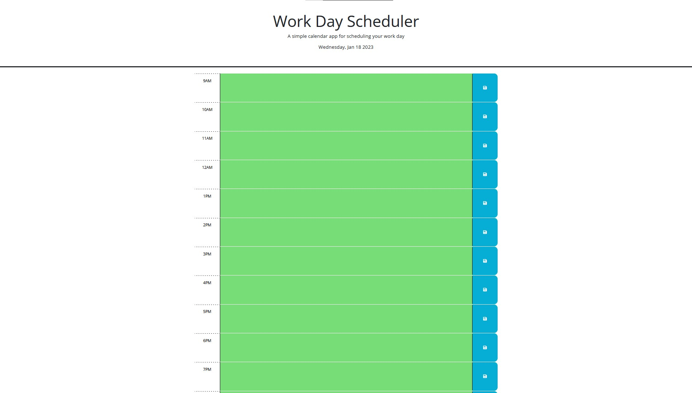

# Description

This is a simple calendar application that allows you to save notes for different hours of the day. The calendar displays the current date and time, and uses color-coding to indicate which hours of the day have passed, which hour is currently happening, and which hours are in the future.

[Track your workday here!](https://navidliwa.github.io/day-tracker/)

# Features

- Displays the current date and time using day.js
- Save notes for different hours of the day using local storage
- Indicates which hours of the day have passed, which hour is currently happening, and which hours are in the future using color-coding

# Page Appearance

This screenshot was taken before 9AM, hence the all the green sections. 

# License

This project is licensed under the MIT License

# Acknowledgements

- [day.js](https://github.com/iamkun/dayjs)